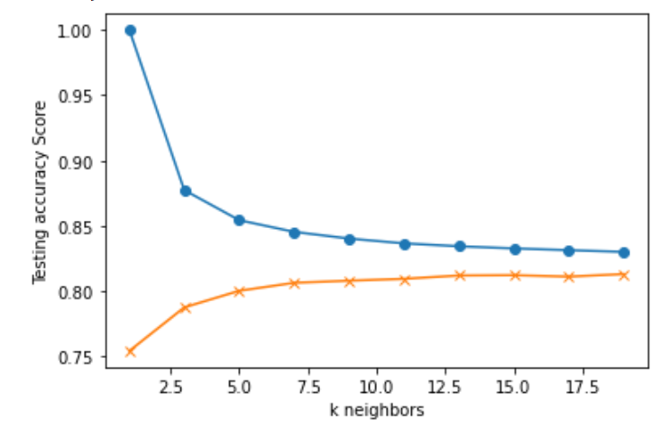
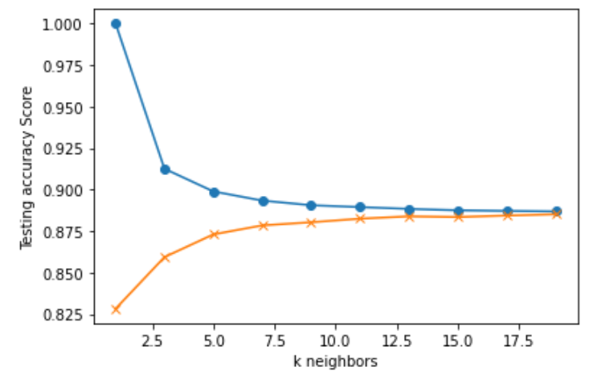
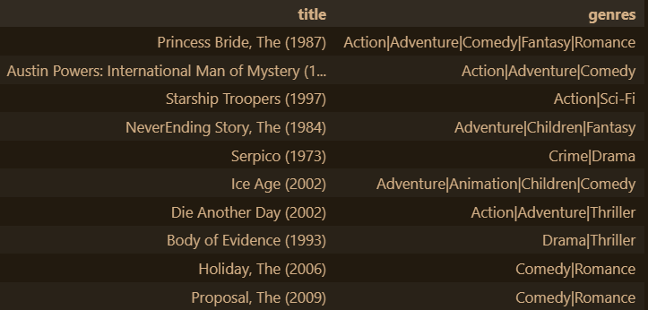

<h1 align="center">Movie Recommendation</h1>

## Team Members: Peregrin Ryan, Anam Khalid, Prathima Polavarapu, Zitarashe Okot

##  https://github.com/Prathima0808/Project-4.git   

# Contents:

 1. [Project Overview](https://github.com/Prathima0808/Project-4/edit/main/README.md#project-overview)
 2. [About DataSet](https://github.com/Prathima0808/Project-4/edit/main/README.md#about-dataset)
 3. [Technologies](https://github.com/Prathima0808/Project-4/edit/main/README.md#technologies)
 4. [Extracting, Transforming and Loading process](https://github.com/Prathima0808/Project-4/edit/main/README.md#extracting-transforming-and-loading-process-etl)
    *  [Connecting DataSets](https://github.com/Prathima0808/Project-4/edit/main/README.md#connecting-datasets)
    *  [Transforming and Loading Data](https://github.com/Prathima0808/Project-4/edit/main/README.md#transforming-and-loading-data)
 6. [ Movie Recommendation using KNN](https://github.com/Prathima0808/Project-4/edit/main/README.md#movie-recommendation-using-knn-with-input-as-movie-id-and-number-of-movies-you-want-to-get-recommended)
 7. [Observasions.](https://github.com/Prathima0808/Project-4/edit/main/README.md#observasions)
 8. [Reference](https://github.com/Prathima0808/Project-4/edit/main/README.md#reference)

# Project Overview

Knowledge-based, Content-based and Collaborative Recommender systems are built on MovieLens dataset with 100836 movie ratings/reviews. These Recommender systems were
built using Pandas operations and by fitting KNN (K-Nearest Neighbours Algorithm), NCF (Neural Collaborative Filtering) & deep learning models which use NN (Neural Network) architecture to suggest movies for the users based 
on similar users and for queries specific to genre, user, movie, rating, popularity.

# About DataSet

In this Project We're used [Movie Lens](https://movielens.org/) Dataset. MovieLens is a rating dataset from the MovieLens website, 
which has been collected over some period. Stable benchmark dataset. 100836 ratings from 610 users on 9724 movies. 
Further information regarding this dataset can be found [here](https://www.kaggle.com/datasets/shubhammehta21/movie-lens-small-latest-dataset).

  This Dataset Consists of 
  * 100836 ratings from 610 users on 9724 movies.
  * Each user has rated at least 20 movies.
  * Simple info contains like( Movie Id, genre, movie Rating)

 ## Our Aim:
 
What to watch? With so many new and old movies out there we are spoiled for choice of what movies to watch next. But that choice leaves us spending more time 
looking for the next movie than actually watching it! It’s also hard to tell if we will even like the movie we settle on with just a blurb and a poster. 
Our goal is to fix this great problem of our time by creating a machine learning model that will help users find what movies to watch next based on a 
user's preferences.
 
# [Getting Strated:](https://github.com/Prathima0808/Project-4/edit/main/README.md#getting-strated)

 To get a local copy up and running follow these simple example steps:
 
 1. Clone the reposirory by using Local Terminal Gitbash [Gitbash Terminal](https://git-scm.com/download/win)
 2. using the [Jupyter Notebook](https://jupyter.org/) in which you performed the preprocessing steps.
 
 
#### [Managing Libraries](https://pypi.org/project/pip/)

 3. sqlalchemy (SQl database)
    * conda install -c anaconda sqlalchemy
    * config
    * pip install config
 
 4. matplotlib.pyplot
 
    * pip install matplotlib
  
 5. tensorflow
    
    * pip install tensorflow
    
 6. numpy
    
    * pip install Numpy
    
 7. Scikit-learn Mechiene Learning Library

# Extracting, Transforming and Loading process (ETL)

    The data was provided to us in a CSV. We checked for any null values in the dataset, and did not have any. We also checked to verify that datatypes 
    matched the variables values as described above. Our data checked out in all these areas, so no additional transformation was required. 
    Then, we created an SQL database for our data to be stored in. We did this using our knowledge of SQL Database and Pandas.

    In this process we're extracting data into dataframe:
    

   ## Connecting DataSets:
   
   * Connect to the local database. Here create a config.py file and keep your username and password in it and save the config.py file in .gitignore file to keep your       username and password confidential. 
      If it's not confidential, you can put it straight away in the code and you won't have to create config.py or .gitignore file then.
 
  
    
   ## Transforming and Loading Data:
   
   * We're choose SQL, first use Spark on Colab to extract and transform the data and then load it into a SQL table on your RDS account. Perform analysis 
     with SQL queries on RDS.
   
   * Join two tables in pgAdmin or join the two tables in with Pandas and SQLAlchemy.
   * The two dataset are successfully loaded into an RDS instance.
   
   
   
   
## K-nearest neighbor model (KNN)
To run and view the KNN model, run the cells in the data_etl.ipynb after the ETL process has been completed (after cell 12) assuming all dependencies have been installed. The model is built by first preparing the data by transforming reviews of 4 stars or higher into values of 1 and reviews lower than 4 stars as 0. Then users with 10 reviews or less are removed from the dataset. After, the data is split into X (movie_id,user_id,timestamps) and y (ratings) for training and testing data. Then the data is scaled, and the KNN model is built, with an accuracy of 78.8%. The process of training the KNN model is also provided as a line graph.

Two more optimisations were performed on the dataset prior to building the data; the second and more successful optimisation had made reviews of 2.5 stars or more into 1 and reviews lower into 0, similar to the first iterations cleaning process. This had made the model roughly 7% more accurate providing a test score of 85.9%.

## Neural Network
The neural network model is located in the “movie_recommendation_using_NN.ipynb” folder. The aim was to use collaborative filtering similar to that of the Kears model provided in their documentation [2]. As well as the model written about in “Neural Collaborative Filtering” [1] . Where users are recommended content based upon similar users preferences, as well as their own preferences. 

To run this file simply open “movie_recommendation_using_NN.ipynb” and run all cells (assuming all dependencies are correctly installed). This process may take some time as there are multiple iterations of the neural collaborative filtering model (NCF).

The program loads in the data from the SQL database, then it cleans the data by creating a dataframe of only needed columns and prepares the data by enumerating it so it indexes at 0 for the machine learning model. As well as creating x and y variables, creating training and testing data and splitting the data. Then a sequential Keras model is built, that is optimized through 4 iterations, then the model visualizes a dataframe of the 10 movie recommendations for the user based on the user_id provided.

Here is an example of movie recommendations for user 314:

[1] "Neural Collaborative Filtering", acessed on the 18th Juanuary 2023. (https://arxiv.org/abs/1708.05031)
[2] "Collaborative Filtering for Movie Recommendations", acessed on the 17th Juanuary 2023 (https://keras.io/examples/structured_data/collaborative_filtering_movielens/)

# Reference:  

* [Convolutional Neural Networks for Visual Recognition](http://cs231n.stanford.edu/)
* [KNN Explanation from Data Science Blog](https://ujjwalkarn.me/2016/08/11/intuitive-explanation-convnets/)
* [Keras documentation for the VGG19 Model](https://keras.io/api/applications/vgg/#vgg19-function)
* [Keras documentation for the Xception model](https://keras.io/applications/#xception)
* [Pyspark documentation](https://spark.apache.org/docs/latest/api/python/)

    

