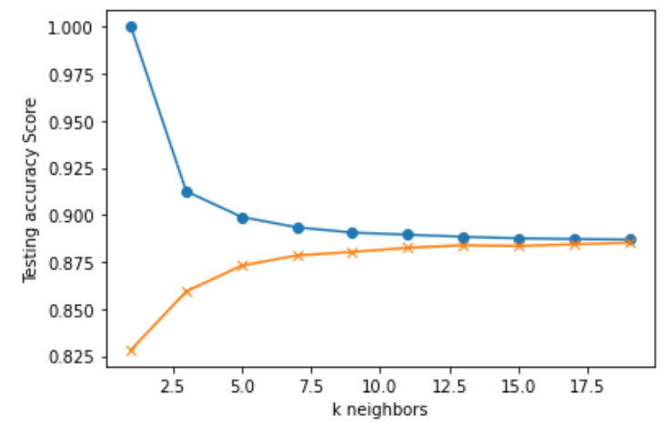

## K-nearest neighbor model (KNN)
To run and view the KNN model, run the cells in the data_etl.ipynb after the ETL process has been completed (after cell 12) assuming all dependencies have been installed. The model is built by first preparing the data by transforming reviews of 4 stars or higher into values of 1 and reviews lower than 4 stars as 0. Then users with 10 reviews or less are removed from the dataset. After, the data is split into X (movie_id,user_id,timestamps) and y (ratings) for training and testing data. Then the data is scaled, and the KNN model is built, with an accuracy of 78.8%. The process of training the KNN model is also provided as a line graph.

Two more optimisations were performed on the dataset prior to building the data; the second and more successful optimisation had made reviews of 2.5 stars or more into 1 and reviews lower into 0, similar to the first iterations cleaning process. This had made the model roughly 7% more accurate providing a test score of 85.9%.

## Neural Network
The neural network model is located in the “movie_recommendation_using_NN.ipynb” folder. The aim was to use collaborative filtering similar to that of the Kears model provided in their documentation (Banerjee, 2020). As well as the model written about in “Neural Collaborative Filtering” (He, et al., 2017) . Where users are recommended content based upon similar users preferences, as well as their own preferences. 

To run this file simply open “movie_recommendation_using_NN.ipynb” and run all cells (assuming all dependencies are correctly installed). This process may take some time as there are multiple iterations of the neural collaborative filtering model (NCF).

The program loads in the data from the SQL database, then it cleans the data by creating a dataframe of only needed columns and prepares the data by enumerating it so it indexes at 0 for the machine learning model. As well as creating x and y variables, creating training and testing data and splitting the data. Then a sequential Keras model is built, that is optimized through 4 iterations, then the model visualizes a dataframe of the 10 movie recommendations for the user based on the user_id provided.

Here is an example of movie recommendations for user 314:
